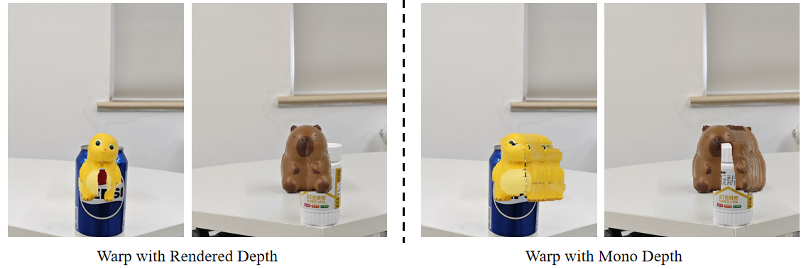

Figure1. Qualitative Comparison with MVIP-NeRF on Two Scenes of HOR.

Figure 2. Visualization of Results from Warping with Rendered and Monocular Depth.

Figure 3. Qualitative Results of Two Scenes from the HOR Dataset on Masked-3DGS.

Figure 4.  Qualitative Results of More Extensive Occlusion Scenes. (Made some cropping to better focus on the target object)

Figure 5. Visualization for the Depths. (Made some cropping to better focus on the target object)

Figure 6. The Failure of GaussianEditor and Manual Removal of Occlusion

Figure 7.  Qualitative Comparison of Manually Removing Occlusion's Gaussians. (Made some cropping to better focus on the target object)